# NoPulse-HUB — Full project documentation (slides)

Original presentation slides and PDF exported from the Cyber X project. Use alongside [`README.md`](../README.md) and [`ARCHITECTURE.md`](ARCHITECTURE.md).

**PDF (all slides):** [`NoPulseHUB.pdf`](NoPulseHUB.pdf)

---

## Slide index

| Slides | Topic |
|---|---|
| [IMG_2083](slides/IMG_2083.JPEG) | Introduction — privacy problem, ISP/DNS exposure, Raspberry Pi hub concept |
| [IMG_2084](slides/IMG_2084.JPEG) – [IMG_2089](slides/IMG_2089.JPEG) | Core services — IP forwarding, kernel hardening, nftables, DNS stack, SSH, WireGuard |
| [IMG_2090](slides/IMG_2090.JPEG) – [IMG_2095](slides/IMG_2095.JPEG) | Kernel hardening (`sysctl`) — martians, source routing, TCP stack |
| [IMG_2096](slides/IMG_2096.JPEG) – [IMG_2102](slides/IMG_2102.JPEG) | `nftables` firewall — INPUT / FORWARD / OUTPUT chains, IPv6 block |
| [IMG_2103](slides/IMG_2103.JPEG) – [IMG_2107](slides/IMG_2107.JPEG) | Secure DNS — Pi-hole → Unbound → DNSCrypt (DoH), qname-minimisation |
| [IMG_2109](slides/IMG_2109.JPEG) – [IMG_2112](slides/IMG_2112.JPEG) | SSH hardening — port 2222, Ed25519 keys, Fail2Ban |
| [IMG_2113](slides/IMG_2113.JPEG) – [IMG_2115](slides/IMG_2115.JPEG) | WireGuard VPN, kill-switch, challenges, lessons, future work |

> **Note:** `IMG_2108` was not in the source export.

---

## Network topology (from slides)

```
Laptop ──Ethernet (eth0)──► Raspberry Pi 3 ──WiFi + antenna (wlan0)──► Home router ──► Internet
                              │
                              └── WireGuard (wg0) ──► ProtonVPN
```

| Interface | Role | Address |
|---|---|---|
| `eth0` | LAN — protected client link | `10.8.0.1/24` |
| `wlan0` | WAN — upstream via home router | `192.168.0.50/24` |
| `wg0` | VPN tunnel | `10.2.0.2/32` |

Config files in this repo: [`configs/`](../configs/)

---

## Security layers (summary)

1. **Routing** — IP forwarding; path `Ethernet → WLAN → WireGuard`
2. **Kernel** — IPv6 off, anti-spoofing, no ICMP redirects, SYN cookies, stealth ping
3. **Firewall** — nftables default-drop; kill-switch if VPN drops
4. **DNS** — Pi-hole (blocklists) + Unbound (local resolver) + DNSCrypt (DoH upstream)
5. **SSH** — Port 2222, key-only, single user, Fail2Ban
6. **VPN** — WireGuard full tunnel to ProtonVPN

---

## Gallery

<details>
<summary>All slides (32 images)</summary>


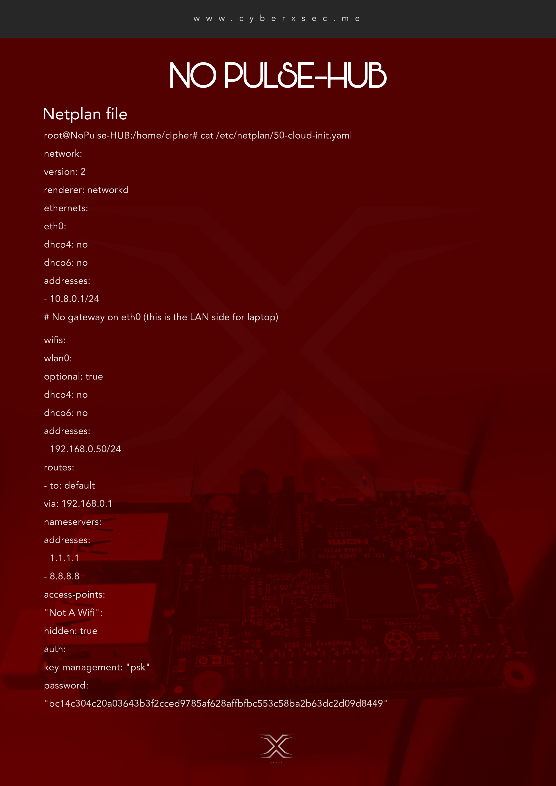


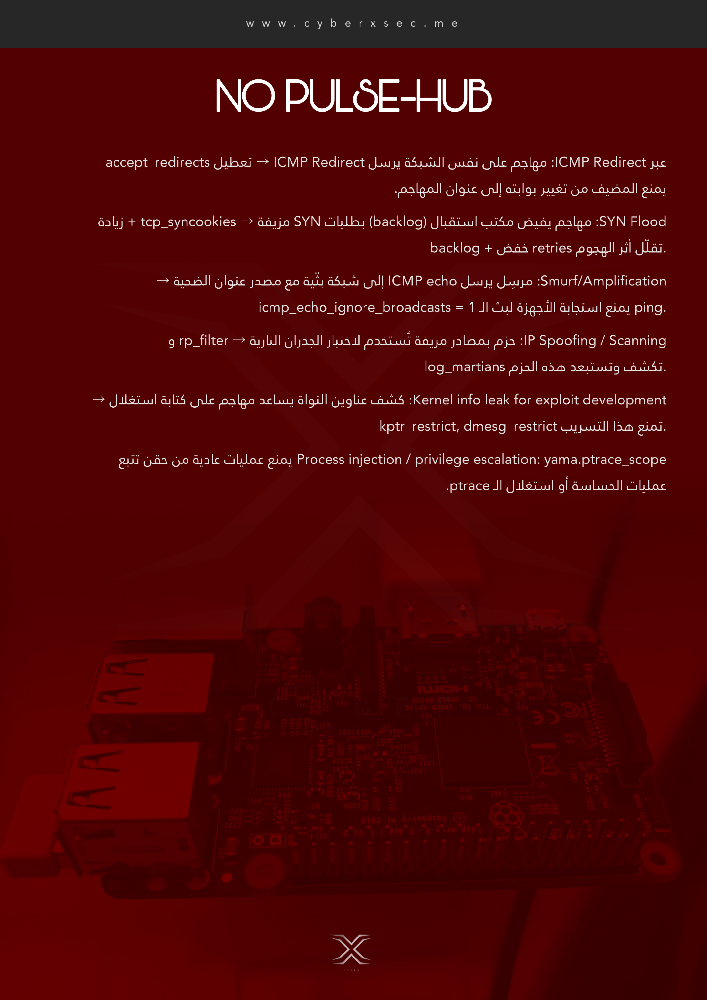
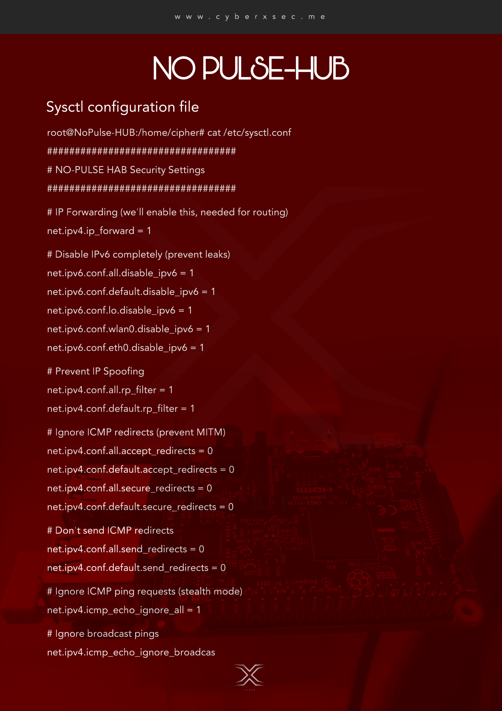
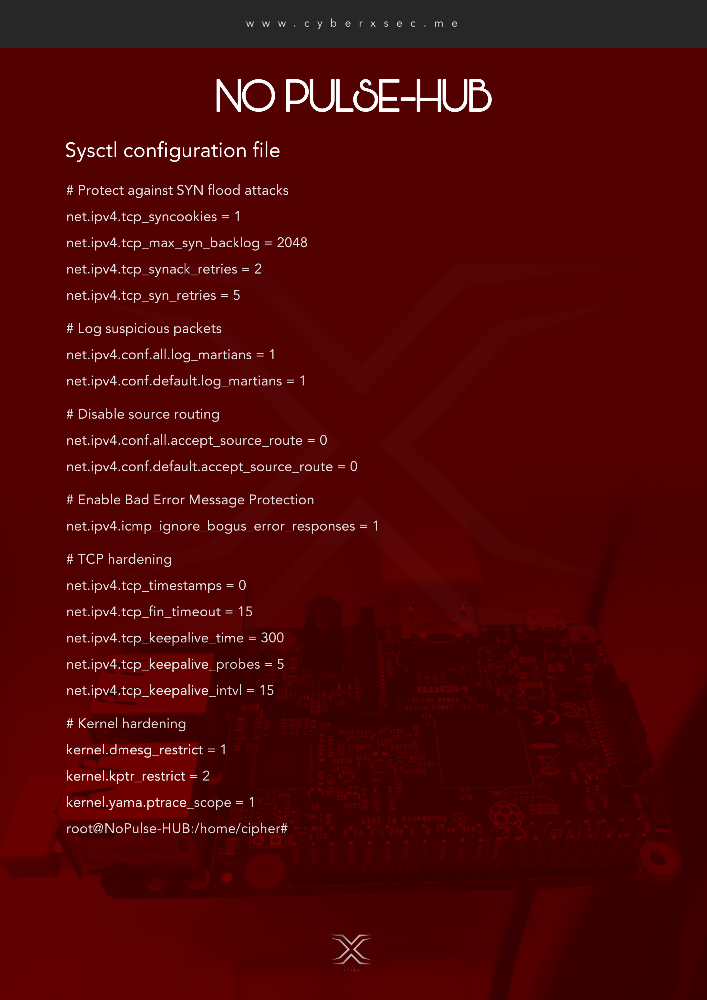


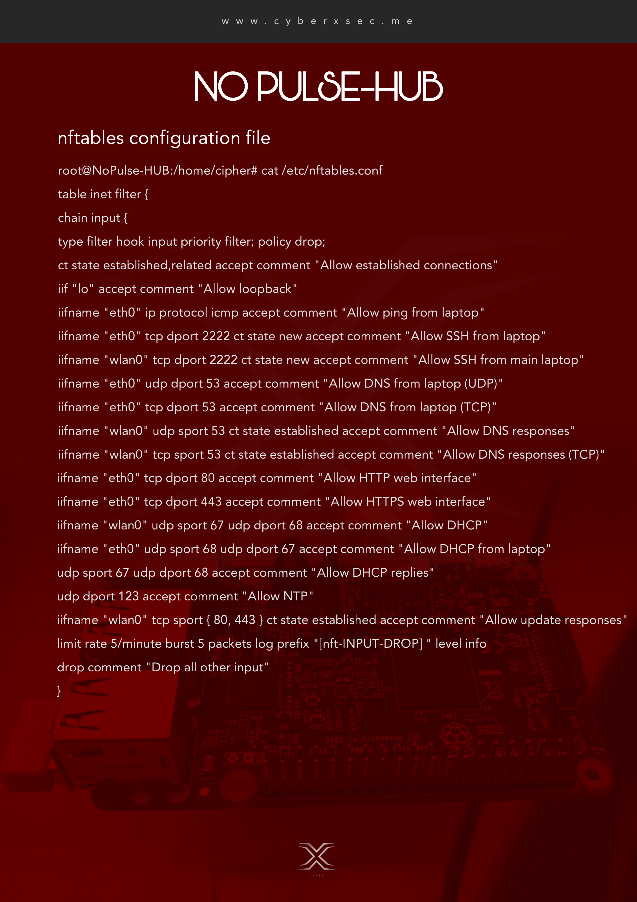
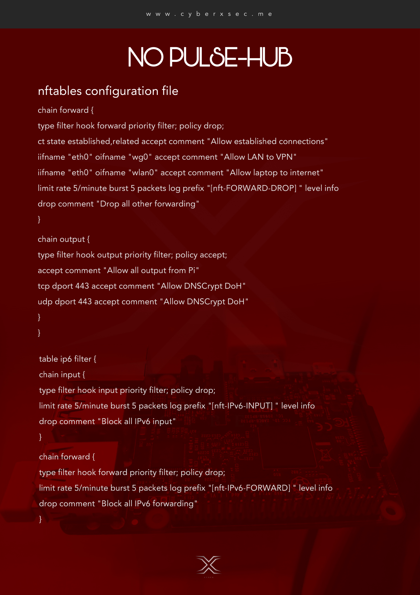
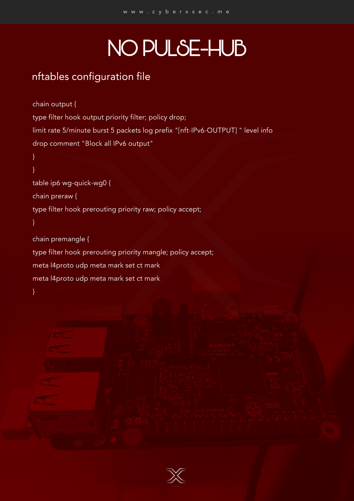


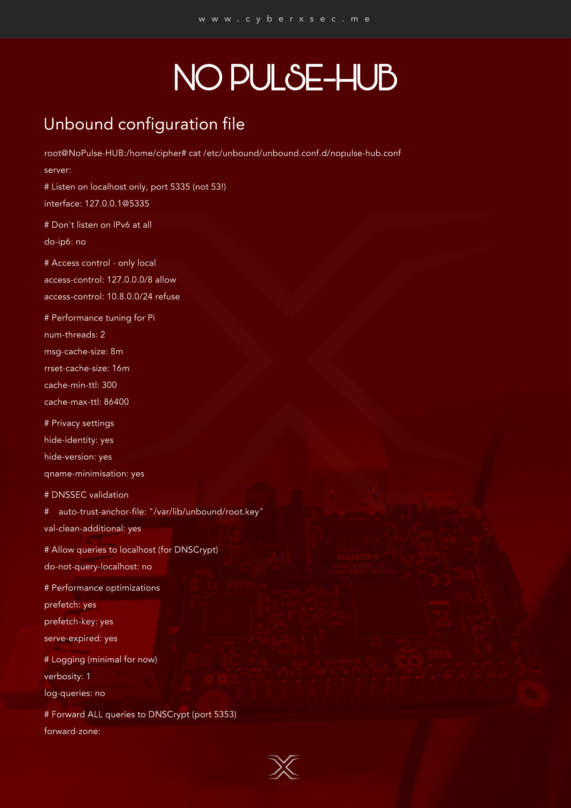
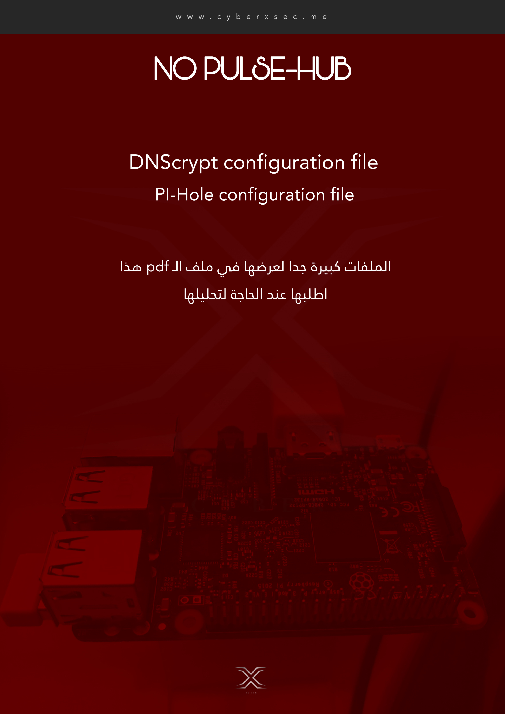


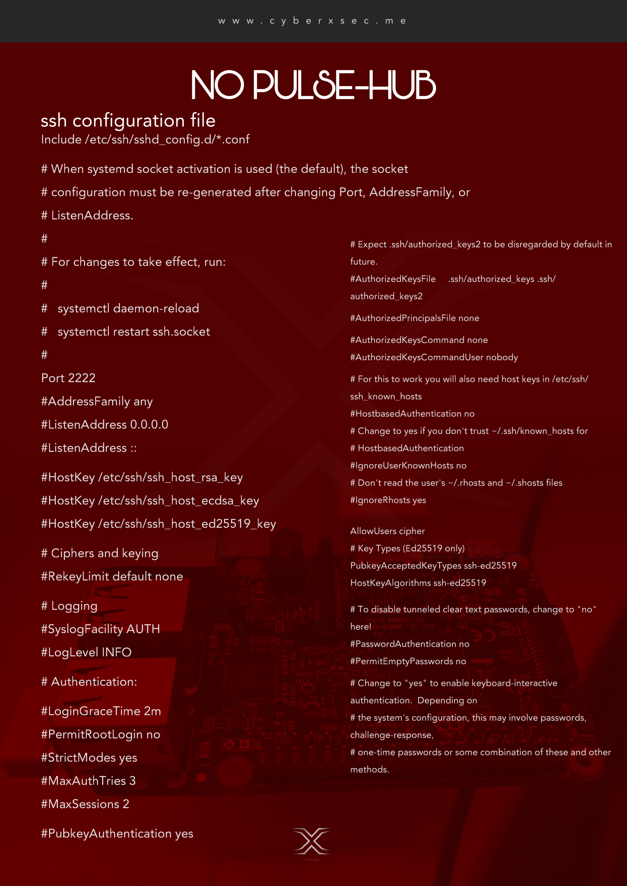
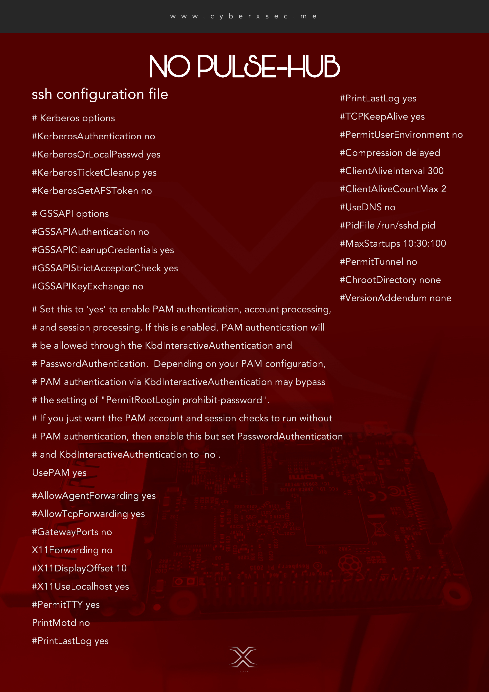

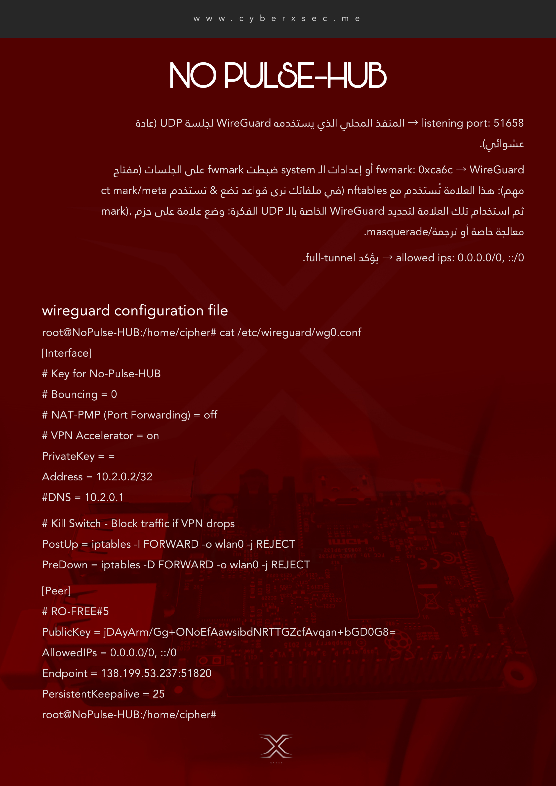


</details>

---

<p align="center"><strong>Cyber X</strong> · <a href="https://cyberxsec.me/Projects/detail.html?slug=NoPulseHub">Project page</a></p>
